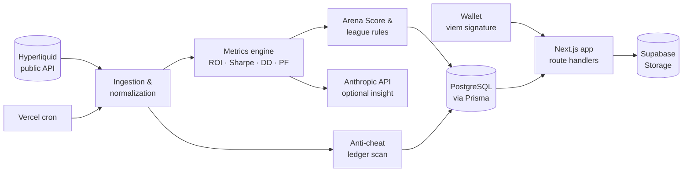

# HyperArena — On-chain Trading Performance Platform

**Turning raw Hyperliquid account data into rigorous trader analytics, composite scores and rule-based trading competitions.**

🌐 **Live product:** [hyperarena.trade](https://hyperarena.trade)

     

---

## The problem

On-chain perpetual exchanges publish everything — fills, funding, deposits, transfers — but raw ledger data says very little about *how good* a trader is. A wallet that is up 300% may simply have received a large deposit; a "profitable" month may be one lucky trade; a leaderboard can be gamed by moving funds between wallets.

HyperArena answers a finance question with engineering: **how do you measure trading performance fairly from a public ledger, and how do you run a competition on top of it that cannot be trivially manipulated?**

## What it does

| Area | What is implemented |
|---|---|
| **Wallet identity** | Wallet connection and signature-based authentication (SIWE-style) with `viem`; profile claiming with username/country; public pages never display wallet addresses |
| **Hyperliquid data ingestion** | Fills (paginated by time window), non-funding ledger updates (deposits, withdrawals, transfers), funding, spot balances, clearinghouse state, sub-account resolution to master wallet |
| **Performance analytics** | Cash-flow-adjusted ROI, realized P&L, win rate, profit factor, average hold time, all-time and 90-day max drawdown, 30-day Sharpe ratio, monthly profitability |
| **Composite scoring** | *Arena Score* (0–99): ROI, consistency, competition results and a capped form/recognition modifier, with an account-maturity coefficient — computed server-side and cached |
| **Leagues & divisions** | Five capital-based leagues (Shrimp → Leviathan), eligibility checks, league suggestion from historical risk per trade, promotion/relegation rates, seasons |
| **Competition engine** | Registration → kickoff → live standings → finalization lifecycle; kickoff balance validation; qualifying-trade thresholds; status-based ranking (Qualified > Not qualified > Eliminated) |
| **Anti-cheat** | Ledger scan during the competition window: any incoming or outgoing transfer on the trading wallet means elimination (internal spot↔perp moves excepted); admin reinstatement with audit log |
| **Visualizations** | Trader profiles, radar chart of trading style, archetypes, rankings, live leaderboards, competition history |
| **AI insights** | Optional natural-language commentary on a trader's statistics via the Anthropic API, cached and rate-limited — layered on top of deterministic metrics, never replacing them |
| **Automation** | Vercel cron jobs: competition status sync (every 5 min) and live standings refresh (every 10 min) |

## Financial methodology

The interesting part of this project is not the UI — it is deciding what each number *means*.

**Separating cash flows from performance.** Deposits, withdrawals and wallet-to-wallet transfers are pulled from the ledger and removed from performance before ROI is computed:

```
ROI = (Current value + Withdrawals − Adjusted deposits) / Adjusted deposits
```

where adjusted deposits include incoming transfers. Airdropped tokens are excluded at their launch price so that a token distribution is not counted as trading skill.

**Sharpe ratio on daily returns.** The profile Sharpe is computed from a daily return series derived from account value and P&L history (30-day window), annualized by √365, with a minimum of 10 valid days and a floor on the previous day's value to avoid division artefacts on near-empty accounts. Below those thresholds the metric is reported as unavailable rather than as a misleading number.

**Two thresholds, never confused.** A *significant* trade (|closed P&L| ≥ 0.1% of capital) feeds quality metrics — win rate, profit factor, form. A *qualifying* trade (≥ 1% of capital, minimum 3 trades) determines competition eligibility. Mixing the two would let dust trades inflate win rates.

**Consistency over luck.** Consistency is measured over the last 12 *active* months with a fixed denominator of 12 and a ramp-up factor for young accounts, so three good months cannot look like a track record.

**Competition fairness.** At kickoff the trading wallet must hold no open position, no non-USDC spot token, and exactly the competition capital (±$0.10). From then on, P&L comes only from fills inside the competition window — spot and perp — and any external transfer is a disqualification.

**Known limits, stated explicitly.** Scores are product-defined heuristics, not investment ratings. Missing history, unpriced assets and API limits affect results, and a high score is not a prediction of future returns.

## Architecture



## Stack

- **Next.js 16 · React 19 · TypeScript** — app router, server-side route handlers
- **Prisma · PostgreSQL** — competitions, registrations, claimed profiles, score snapshots, audit log
- **Supabase** — hosted Postgres and public-read storage buckets (avatars, sponsor logos) written only through authenticated server routes
- **viem** — wallet signature verification
- **Anthropic API** — optional AI commentary on trader statistics
- **Vercel** — hosting and scheduled jobs
- **Tailwind CSS 4**

## Engineering practices

- Scores computed **server-side only** and cached in a snapshot table; the client never computes a number that matters
- Admin actions protected by a signed session cookie (wallet signature) and written to an **audit log**
- Service-role credentials confined to server routes; nothing sensitive in `NEXT_PUBLIC_*`
- Product rules documented in versioned specs (data model, scoring rules, competition lifecycle, user flows) and kept in sync with the code
- Verification passes after each refactor (e.g. the June 2026 stats refactor moved all profile statistics server-side and corrected the Sharpe and drawdown series)

## How it was built

HyperArena was designed and built by **[fabolousfab7](https://github.com/fabolousfab7)** — a finance professional (Master's in Audit & Finance) and active derivatives trader — using AI-assisted development.

The division of labour is deliberate: the AI accelerates implementation; I own the financial specification, the rules, and the verification. Most of the work consisted of defining what a metric should measure, spotting where an implementation diverged from that definition, and documenting the decision — the same skills required to evaluate the financial reasoning of an AI model.

## About this repository

This is a public case study. The production source code stays private: it contains anti-cheat parameters and operational data that must not be published. This repository documents the product, its financial methodology and its architecture. A walkthrough of specific modules is available on request.

For a public, fully runnable example of my financial engineering work, see [financial-portfolio-dashboard-showcase](https://github.com/fabolousfab7/financial-portfolio-dashboard-showcase).
